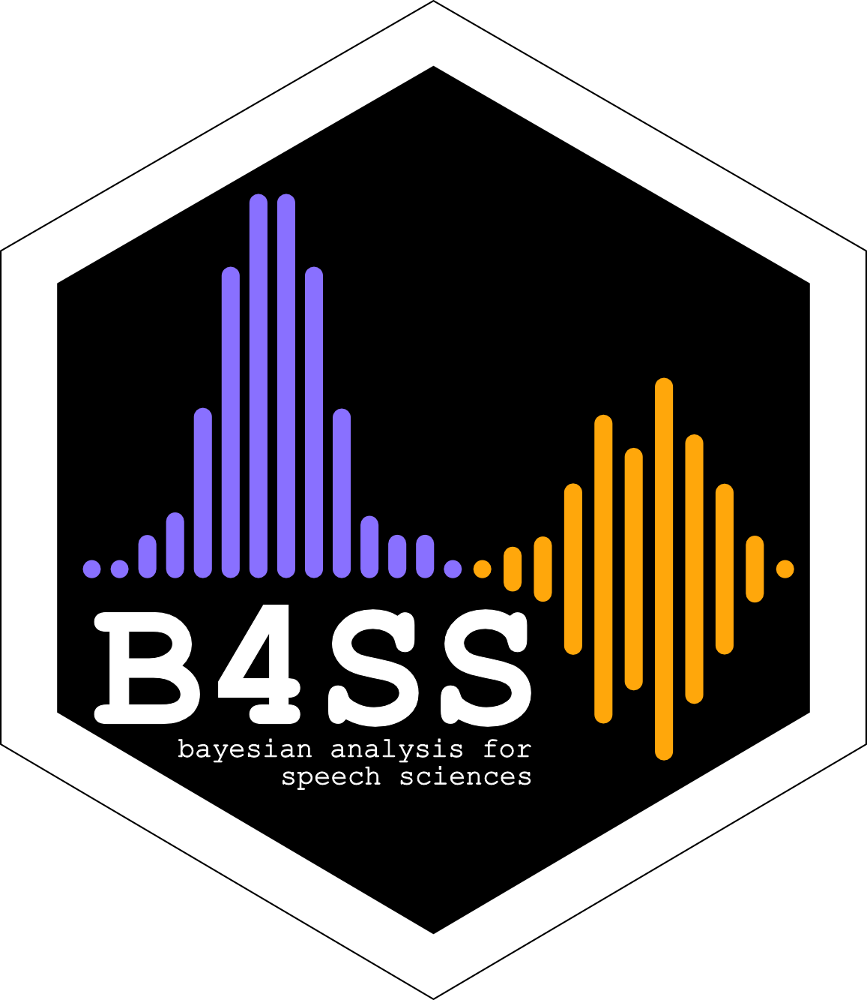

<!-- README.md is generated from README.Rmd. Please edit that file -->

```{r, include = FALSE}
knitr::opts_chunk$set(
  collapse = TRUE,
  comment = "#>",
  eval = FALSE
)
```

# learnB4SS Starter Kit  <a href='https://learnb4ss.github.io/learnB4SS'></a>

Welcome to learnB4SS!

This is the workshop's **starter kit** to help you get set up without hassle.

For more info on the workshop, check out the workshop's [website](https://learnb4ss.github.io) and the [learning materials](https://learnb4ss.github.io/learnB4SS/index.html).

**NOTE**: This kit is just a convenient way of setting up an RStudio project that you can use during the workshop. If you are comfortable with RStudio, you can choose to set up your own RStudio project instead of downloading this kit. If you choose not to use the Starter Kit, you can just follow the [installation instructions for the learnB4SS package](https://learnb4ss.github.io/learnB4SS/articles/install-learnb4ss.html).
Note that the learnB4SS package and materials are best used from RStudio.

## Prerequisite

It is essential that you went through the installation of brms and its dependencies before downloading this kit.

If you have not installed brms yet, you can follow the instructions for your system here: [How to install brms and dependecies](https://learnb4ss.github.io/learnB4SS/articles/install-brms.html).

## Download the kit

To download the kit, click on the green `Code` button above and then select `Download ZIP`.

Unzip the downloaded file and move the contents where you like!

<details>
  <summary>If you use git...</summary>
  <p>Run <code>git clone https<span></span>://github.com/learnB4SS/learnB4SS-kit.git</code> in your command line.</p>
</details>

## Use the kit

After downloading and unzipping the kit, double-click on the file called `learnB4SS-kit.Rproj`.

RStudio will start and load the project.

If [remotes](https://remotes.r-lib.org) is not installed on your system, install it first:

```{r remotes}
install.packages("remotes")
```

You might be asked to update existing packages. If so, type your answer in the RStudio console.

Now, install the learnB4SS package with:

```{r install}
remotes::install_github("learnB4SS/learnB4SS", build_vignettes = TRUE)
```

You might be asked to update existing packages. If so, type your answer in the RStudio console.

Several package dependencies will be installed too.

🎉🎉🎉 Finally, attach the learB4SS package! 🎉🎉🎉

```{r}
library(learnB4SS)
```

## Use the learnB4SS package

Now you can use the function `open_slides()` to open the session slides in your browser and `open_exercise()` to open the exercise files.

```{r open}
# Open slides of session 00
open_slides(00)

# Open exercise of session 03
open_exercise(03)
```

We will use the `polite` data throughout the workshop.

You can load the data with:

```{r data}
data("polite")

# Learn about the data
?polite
```

<br>
